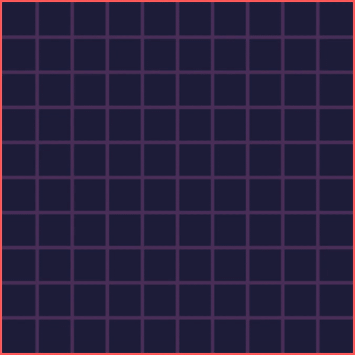

# Maze Generation Algorithms (Randomized Kruskal's Algorithm) (Session 2)

# Description

This repository is the second [session of Maze Generation Algorithms](https://github.com/VusalIs/Maze-Generation-Algorithms-Session-0-) and will explain how you can implement Randomized Kruskal's Algorithm to generate random maze. Let's get started:

-   [Demo](#demo)
-   [What is Kruskal's Algorithm?](#What-is-Kruskal's-Algorithm)
-   [How you can implement Randomized Kruskal's Algorithm for maze generation?](#How-you-can-implement-Randomized-Kruskal's-Algorithm-for-maze-generation)
-   [What is the code implementation?](#What-is-the-code-implementation)
-   [Thanks for your attention](#Thanks-for-your-attention)

# Demo

This repository has all codes which I have used in the demo. You are Welcome to pull this repository and explore or edit it. Additionally, If you want to see live demo you can use following link:



# What is Kruskal's Algorithm?

Kruskal's Algorithm originally used to find a minimum spanning tree for a given tree. The minimum spanning tree is a subtree of the given tree with the minimum possible total edge weight and does not have any cycle. I will upload the visualization and explanation of this algorithm soon..

# How you can implement Randomized Kruskal's algorithm for maze generation?

Randomized Kruskal's Algorithm is a little bit changed version of Kruskal's Algorithm. In this visualization, I have created 2 arrays (walls, cells). We can assume that every wall is a tree node which root equals to null. After initiate everything, I shuffle the walls array and start from the first wall. If the wall has neighbor cells with the same root that means they are already connected and we don't have to do anything(except changing its color). If the wall has neighbor cells with different roots that means we have to connect them (It means we just make the root of one cell to children of another cell). The program does it for every wall. The steps are described below:

1. Create a list of all walls, and create a list of all cells, each containing just that one cell with null root.
1. Shuffle all walls:
1. Start from the first wall and follow below instruction:
    1. If the cells divided by this wall have the same root:
        1. Remove the current wall.
        1. Make one cell subtree of another cell.

# What is the code implementation?

I have already talk about basic file structure in the [session 0](https://github.com/VusalIs/Maze-Generation-Algorithms-Session-0-). Now It is time to code implementation of the algorithm.

```javascript
function algo() {
    if ((currentWall.initPoint.x == 0 && currentWall.desPoint.x == 0) || (currentWall.initPoint.y == 0 && currentWall.desPoint.y == 0)) {
        currentWall.status = 'CLEAR';
        return;
    }

    currentWall.status = 'CHECKING';
    currentX = currentWall.initPoint.x / cellSize;
    currentY = currentWall.initPoint.y / cellSize;

    var neighbor1;
    var neighbor2;
    if (currentWall.initPoint.x == currentWall.desPoint.x) {
        neighbor1 = cells[cellCountRow * currentY + currentX];
        neighbor2 = cells[cellCountRow * currentY + currentX - 1];
    } else {
        neighbor1 = cells[cellCountRow * (currentY - 1) + currentX];
        neighbor2 = cells[cellCountRow * currentY + currentX];
    }

    neighbor1.status = 'VISITED';
    neighbor2.status = 'VISITED';

    if (neighbor1.getRoot() != neighbor2.getRoot()) {
        neighbor1.getRoot().parent = neighbor2.getRoot();
        currentWall.status = 'CLEAR';
    } else currentWall.status = 'VISITED';
    currentWall = walls[index];
}
```

First, we check that our wall if it is on the edge or not, and if it is not we have to find which cells are divided by this wall. We can do that based on the x and y coordinates. Remember that every cell is also a node, that is why we check neighbor cells' roots, and if they are not the same, that means they are not connected. To connect those two cells, we make the root of one cell to children of another cell. This process is the concatenation of the trees. If the cells are already connected, we don't do anything and skip this wall(except changing its color).

# Thanks for your attention

Thanks for your attention! See you 👋
